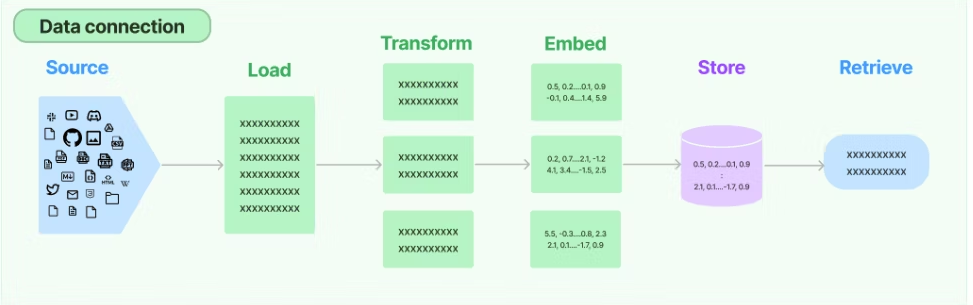

# RAG

LLMが学んでいることより新しい情報やプライベートな情報を回答させたい場合、
コンテキストとしてプロンプトに含めて質問すると回答させることができる。  
しかし、LLMのトークン数には最大値の制限があるため、あらゆるデータをコンテキストとして含めることはできない。  
入力をもとに文書を検索して、検索結果をコンテキストに含めてLLMに回答させる手法がRAG（Retrieval-Augmented Generation）と呼ばれる。  
RAGの典型的な構成としては、ベクターデータベースを使い、文書をベクトル化して保存しておいて、入力のテキストとベクトルの近い文書を検索してコンテキストに含める方法がある。  
文書のベクトル化にはOpenAIのEmbeddings APIなどを使用する。  

## LangChainのRAGに関するコンポーネント

主要なコンポーネントは以下の5つ

- Document Loaders
    - データソースからドキュメントを読み込む
- Document Transformers
    - ドキュメントに何らかの変換をかける
- Embedding model
    - ドキュメントをベクトル化する
- Vector Store
    - ベクトル化したドキュメントの保存先
- Retriever
    - 入力テキストと関連するドキュメントを検索する

RAGを実現するコンポーネントのつながり

## Document loder

| Loader名                  | 概要                                         | 対応フォーマット例                         |
| ------------------------ | ------------------------------------------ | --------------------------------- |
| `TextLoader`             | プレーンテキストファイルを読み込む                          | `.txt`                            |
| `PyPDFLoader`            | PDFをページ単位で読み込む                             | `.pdf`                            |
| `PDFPlumberLoader`       | PDFを段落や構造付きで読み込む（レイアウト保持に強い）               | `.pdf`                            |
| `UnstructuredFileLoader` | PDF、HTML、画像など色々読み込める万能型（`unstructured`に依存） | `.pdf`, `.html`, `.eml`, `.png` 他 |
| `WebBaseLoader`          | WebページのHTMLを読み込んで本文を抽出                     | Web URL                           |
| `BSHTMLLoader`           | BeautifulSoupベースでHTMLファイルを解析               | `.html`                           |
| `DirectoryLoader`        | ディレクトリ内のファイルをまとめて読み込む                      | 任意（`loader_cls`で指定）               |
| `NotionDBLoader`         | NotionのDBからデータを取得                          | Notion API                        |
| `CSVLoader`              | CSVファイルを読み込んでドキュメント化                       | `.csv`                            |
| `DataFrameLoader`        | pandasのDataFrameからドキュメント化                  | `pandas.DataFrame`                |
| `EverNoteLoader`         | Evernoteのエクスポート（.enex）ファイルを読み込む            | `.enex`                           |
| `OutlookMessageLoader`   | Outlookの `.msg` メールファイルを読み込む               | `.msg`                            |
| `Docx2txtLoader`         | Wordファイルを読み込む（`docx2txt`ライブラリ使用）           | `.docx`                           |
| `PowerPointLoader`       | PowerPointファイルをスライド単位で読み込む                 | `.pptx`                           |
| `EPubLoader`             | 電子書籍（ePub形式）を読み込む                          | `.epub`                           |

## Document transformer

代表的な使い方として、ドキュメントをある程度の長さでチャンクに分割する際に利用する。

| Transformer名                     | 概要                                      |
| -------------------------------- | --------------------------------------- |
| `CharacterTextSplitter`          | 文字数ベースでドキュメントを分割（超基本）                   |
| `RecursiveCharacterTextSplitter` | 段落・文・単語などの区切りを考慮して自然に分割（高機能）            |
| `TokenTextSplitter`              | トークン数ベースで分割（OpenAIモデルなどのトークン制限に合わせやすい）  |
| `MarkdownHeaderTextSplitter`     | Markdownの見出しごとにドキュメントを分割                |
| `SentenceTransformersEmbedder`   | Sentence Transformersでベクトル化（埋め込み用）      |
| `DocumentCompressorPipeline`     | 複数のtransformerをパイプラインで適用                |
| `LLMChainExtractor`              | LLMで特定の情報を抽出・要約（LangChain LLMと組み合わせて使う） |
| `HtmlHeaderTextSplitter`         | HTMLの `<h1>`, `<h2>` 等の見出し単位で分割         |

## Embedding model

テキストのベクトル化を行う。
例ではOpenAIのEmbeddings APIを使い、text-embedding-3-smallでベクトル化する。

## Vector store

ベクトル化したドキュメントを保存する場所。例ではChromaというローカルで使用可能なVector Storeを使う。
LangchainではChromaのほかに、Faiss、ElasticSearch、Redisなど多くのインテグレーションが提供されている。

VectorStoreにたいしては、ユーザ入力に関連するドキュメントを得る操作を行う。Langchainにおいてテキストに関連するドキュメントを得るインターフェースを`Retriever`と呼ぶ。

## LCEL(Chain)

上記はChainを使用して構成することができる。