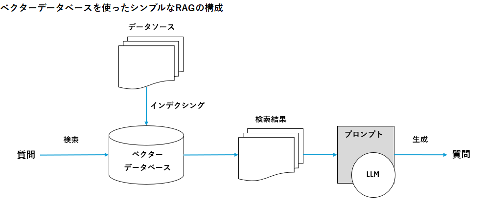
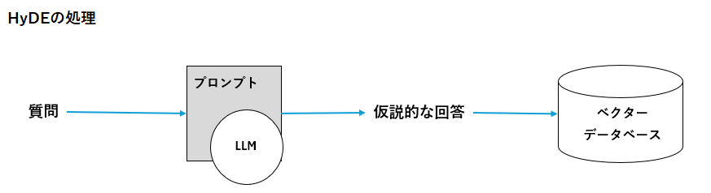
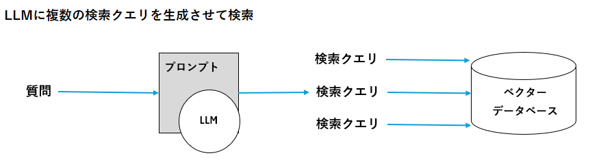
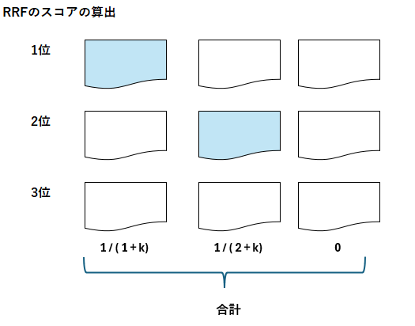
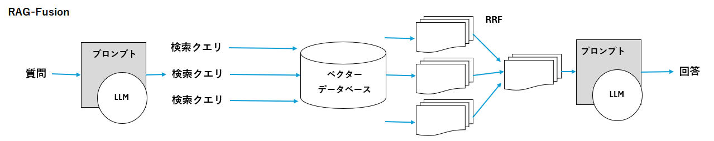
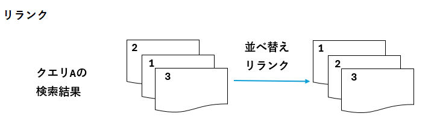

# Advanced RAG

## Advanced RAGの概要

以下はベクターデータベースを使ったシンプルなRAGの構成

あらかじめ、データソースの文書をベクトル化して、ベクターデータベースにインデクシングしておく。ユーザの質問に対して、質問を検索クエリとしてベクターデータベースを検索し検索結果を取得。検索結果をプロンプトに入れてLLMが回答を生成する。

Advanced RAGでは以下の工夫を入れることが基本となる

- インデクシングの工夫
- 検索クエリの工夫
- 検索語の工夫
- 複数のRetrieverを使う工夫
- 生成後の工夫

LangChainが処理の工夫を整理した例としてrag-from-scratchというリポジトリを公開していいる。  
[rag-from-scratch](https://github.com/langchain-ai/rag-from-scratch)

## インデクシングの工夫

インデクシングの工夫としては、以下のような方法がある。
- **Chunking**: 文書を小さなチャンクに分割してインデクシングする。これにより、検索の精度が向上し、関連する情報をより効率的に取得できる。
- **Metadataの追加**: 各チャンクにメタデータを追加することで、検索結果のフィルタリングやランキングを行いやすくする。例えば、
  - 文書のタイトルや著者名
  - 文書のカテゴリやタグ
  - 文書の作成日や更新日
- **Embeddingの工夫**: 文書の埋め込みを工夫することで、検索の精度を向上させる。例えば、
  - 文書の埋め込みを複数のモデルで生成し、アンサンブルする
  - 文書の埋め込みをファインチューニングする
- **インデクシングの更新**: 新しい文書が追加された場合、インデクシングを更新することで、最新の情報を検索できるようにする。これには、以下の方法がある。
  - 定期的にインデクシングを更新する
  - 新しい文書が追加された場合、インデクシングをリアルタイムで更新する
- **インデクシングの最適化**: インデクシングのパフォーマンスを向上させるために、以下の方法がある。
  - インデクシングの並列化: 複数のスレッドやプロセスを使って、インデクシングを並列に実行する。
  - インデクシングのキャッシュ: 一度インデクシングした文書をキャッシュしておき、再度インデクシングする必要がないようにする。
  - インデクシングの分散化: 複数のサーバーを使って、インデクシングを分散して実行する。

そもそもRAGの精度は検索対象のドキュメントの質に大きく依存する。もしRAGの精度が向上しない原因がドキュメントの質であればその部分を改善する必要がある。RAGの精度向上には、ドキュメントの質・検索の精度・生成の精度といったどこがボトルネックなのかに注意して取り組むことが重要。

## 検索クエリの工夫

### HyDE(Hypothetical Document Embedding)

RAGから実際に検索したいのは、質問に類似するドキュメントではなく、回答に類似するドキュメントである。  
HyDEという手法では、質問に対してLLMに仮説的な回答を推論させ、その出力で検索を行う。

LangchainはHydeを実装したHypotheticalDocumentEmbedderというクラスを提供している。使いやすさはこちらが上かもしれない。

### 複数の検索クエリの生成

上のように1回だけのクエリ生成ではなく、複数のクエリを生成して検索することで、より適切なドキュメントを取得できる可能性がある。

## 検索後の工夫

### RAG-Fusion

ドキュメントの検索結果をプロンプトに入れる場合は、何らかの順番で並べる必要がある。複数の検索結果の順位を融合して並べるアルゴリズムとして**RRF**(Reciprocal Rank Fusion)がある。RRFでは各検索クエリの「**1/(順位+k)**」の合計値をスコアとして計算し、スコアの高い順に並べる。kはパラメータで、60などの値を使用する。kは上位ドキュメントの重みを調整するための定数。値が小さいほど上位順位への重みが極端に高くなる。値が小さいほどスコア差が緩やかになり多様な候補二スコアが分散する。k=60が多く用いられる。

kの値|特徴・用途
---|---
小さい(1~10)|上位候補を強く優遇したいとき(制度重視)
中程度(30~60)|バランス型。RRFの標準的な使用方
大きい(100~)|多様性を重視し、全体から幅広く統合したいとき

### リランクモデルの概要

検索した結果について改めて並べ替えることでより適切なドキュメントを選ぶことができる。  
リランクモデルは、検索結果のドキュメントを再評価し、より適切な順序に並べ替えるためのモデルである。  
埋め込みベクトルよりも計算コストが高いが、ランキング精度の高い。  
まず計算コストの低い埋め込みベクトルの類似検索を行い、次にリランクモデルを適用することでより精度の高い検索結果を得られやすい。

リランク処理の実装にはLangChainのContextualCompressionRetrieverを使うことができる。
